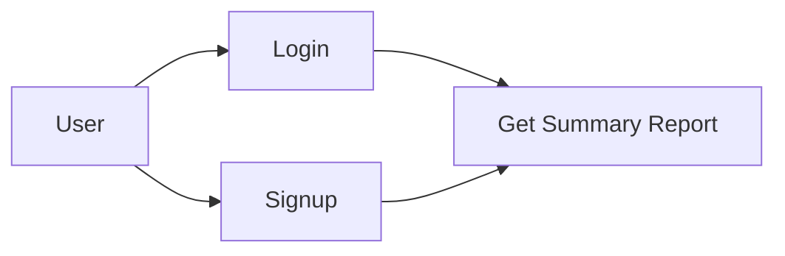

# stantech-ai-assessment

This project is a Django-based web application for generating summary reports based on product data. It allows users to sign up, log in, and download a summary report in CSV format, with the data either generated randomly or provided via a CSV file.

## Table of Contents

- [Setup](#setup)
- [API Endpoints](#api-endpoints)
- [Data Model](#data-model)
- [Usage](#usage)
- [Created By](#created-by)

## Setup

### Requirements

Ensure you have the following installed:

- Python 3.x
- Django 5.x
- pandas
- Django REST Framework

## Installation

1. **Clone the repository:**

   ```bash
   git clone https://github.com/vikaaas-99/stantech-ai-assessment.git
   ```

2. **Create and activate a virtual environment:**

   ```bash
   python -m venv env
   source env/bin/activate  # On Windows: env\Scripts\activate
   ```

3. **Install dependencies:**

   ```bash
   pip install -r requirements.txt
   ```

4. **Run migrations:**

   ```bash
   python manage.py migrate
   ```

5. **Load initial data:**

   You can load data either from a CSV file or generate random data using the provided management command:

   ```bash
   python manage.py load_data
   ```

6. **Run the development server:**

   ```bash
   python manage.py runserver
   ```

### Environment Variables

Ensure the following environment variables are set in your `.env` file:

```bash
DB_NAME=your_db_name
DB_USER=db_user
DB_PASSWORD=db_password
```

## API Endpoints

### 1. **User Signup**

**URL:** `/analytics/signup/`  
**Method:** `POST`  
**Request Body:**

```json
{
    "username": "exampleuser",
    "password": "examplepass"
}
```

**Response:**

```json
{
    "message": "User `exampleuser` created successfully"
}
```

### 2. **User Login**

**URL:** `/analytics/login/`  
**Method:** `POST`  
**Request Body:**

```json
{
    "username": "exampleuser",
    "password": "examplepass"
}
```

**Response:**

```json
{
    "access": "your_jwt_token"
}
```

### 3. **Get Summary Report**

**URL:** `/analytics/get-summary-report/`  
**Method:** `GET`  
**Response:** CSV file download

### API Workflow



## Data Model

The primary data model used in this project is `ProductData`. It represents the product information used to generate the summary reports.

### Fields:

- `product_id`: Integer
- `product_name`: String
- `category`: String
- `price`: Float
- `quantity_sold`: Integer
- `rating`: Float
- `review_count`: Integer

## Usage

### Loading Data

You can load product data from a CSV file or generate random product data using the `load_data` management command:

```bash
python manage.py load_data
```

### Generating Reports

After logging in, you can request a summary report via the `/analytics/get-summary-report/` endpoint, which will return a CSV file containing the top-selling product for each category.

## Created by

[](https://www.linkedin.com/in/vikaas-sharma/)
[](https://github.com/vikaaas-99)
